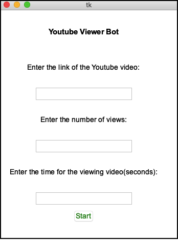

# youtubeViewerBot
Bot for increasing the number of views on Youtube 📈🤖

## Prerequisites
- Python 3.7
- Selenium
- Google Chrome
- [ChromeDriver] (https://chromedriver.chromium.org/downloads)


## Getting Started
1. Change the path for ChromeDriver in main.py
2. Run the program
```
$ python main.py
```
2. Enter the link of the Youtube video
3. Enter the number of views and the time for the viewing video
3. Press "Start" button





## License
[MIT License](https://choosealicense.com/licenses/mit/)
